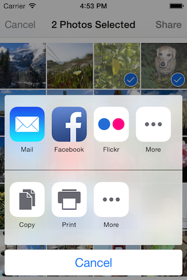
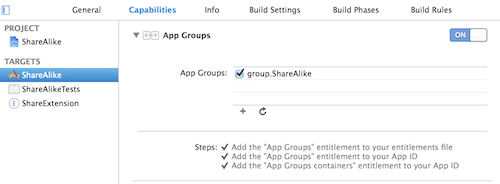
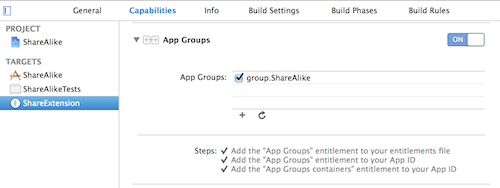
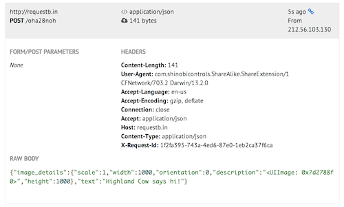

# iOS8 Day-by-Day :: Day 2 :: Sharing Extension

This post is part of a daily series of posts introducing the most exciting new
parts of iOS8 for developers - [#iOS8DayByDay](https://twitter.com/search?q=%23iOS8DayByDay).
To see the posts you've missed check out the [index page](http://shinobicontrols.com/iOS8DayByDay),
but have a read through the rest of this post first!

---

## Introduction

A __huge__ new feature in iOS8 is the introduction of support for extensions.
These are areas in which developers can enhance the operating system, including
both 3rd-party apps and Apple-provided apps, with their own features and
functionality. There are 6 extensions applicable to iOS:

- Today screen widgets
- Share extensions
- Actions
- Photo editing
- Storage providers
- Custom keyboards

We'll cover some of these in later editions of iOS8 Day-by-Day, but today's article
is focussed on sharing extensions.

Sharing extensions give you, the developer of an app, to show an icon on the
common share-sheet, and then to handle the sharing of the content the user has
requested. This means that you can supplement the list of possibilities present
in the OS (e.g. Twitter, Flickr, Sina Weibo).

A word of warning: this topic is not an easy one. From the mere nature of an
extension it is pretty complex. The article will take you through some of the
most common use cases, but be aware that you can pretty much build your own
visual appearance. Apple has some excellent resources in this area, so it's
worth having a read through them if you get stuck with anything.

The sample app for today's post is called "ShareAlike", and demonstrates building
a sharing extension which allows sharing an image and some text. The code is
available on Github at
[github.com/ShinobiControls/iOS8-day-by-day](https://github.com/ShinobiControls/iOS8-day-by-day).

## Creating a share extension

Extensions are compiled binaries which have to be contained within an app - it's
not possible to add an extension to the system without an accompanying app.
Xcode has a template for adding an extension to an existing app - it'll set up
a new module within your project and provide you with the required files to get
started.

The major part of a sharing extension is its visual appearance, and as such
you're provided with a subclass of `SLComposeServiceViewController` and a
storyboard. The default appearance of `SLComposeServiceViewController` gives you
a lot of sensible behaviour (including a character count, image display, text
entry, post and cancel buttons) and fits in with the iOS UI. In this example
we're going to stick with this default behaviour.

In addition to the standard `UIViewController` methods, `SLComposeServiceViewController`
has some methods and properties associated with the lifecycle of a share-sheet
composition view:

- `presentationAnimationDidFinish()` this provides a great hook to perform any
heavy-lifting tasks. We'll use this to extract the image to share.
- `contentText` a string which represents what the user has typed into the
composer
- `didSelectPost()` called when the __Post__ button is tapped. The point to kick
off the upload task.
- `didSelectCancel()` called when the __Cancel__ button is tapped.
- `isContentValid()` called every time the content in the compose view changes.
- `charactersRemaining` is a number which appears on the compose sheet. When
negative its appearance becomes red

Simply adding an extension to your app's project will allow it to be selected when
a user requests to share something. We'll take a look at implementing some useful
functionality soon, but first, let's learn a little about how to build, run
and debug.

### Building, running and debugging

In theory, you should be able to select the scheme associated with the extension
and hit run. You'll then be asked which host app you'd like to debug it in, and
you'll be away. This experience can be more than a little flakey. The only apps
it is possible to choose (as of Xcode 6b3) are your own development apps - not
system apps. This seems a little strange - the perfect app for testing sharing
would be the photos app.

However, the following approach seems to be reliable:

1. Either use your extension's host app, or add a new app to the same project
which has easily available content for sharing. In the sample project, the
__ShareAlike__ host app has an image and a share button which will trigger a
standard UI share sheet:
        @IBAction func handleShareSampleTapped(sender: AnyObject) {
          shareContent(sharingText: "Highland Cow", sharingImage: sharingContentImageView.image)
        }

        // Utility methods
        func shareContent(#sharingText: String?, sharingImage: UIImage?) {
          var itemsToShare = [AnyObject]()

          if let text = sharingText {
            itemsToShare.append(text)
          }
          if let image = sharingImage {
            itemsToShare.append(image)
          }

          let activityViewController = UIActivityViewController(activityItems: itemsToShare, applicationActivities: nil)
          presentViewController(activityViewController, animated: true, completion: nil)
        }

2. Develop your extension
3. To debug and or test, run the scheme associated with your app. Then when you
hit share then the debugger will automatically attach to the process associated
with the extension.
4. You can use the sharing extension from other apps on the simulator, but you
won't have debuggin access. It's good to get it to a working state and then test
it within the Photos app.

### Specifying what can be shared

In the same way that the settings associated with an app are contained within
an __Info.plist__ file, there is an equivalent file for the extension module.
One of the things you can control is the name of the extension which appears
under the icon in the share sheet.

The name is defined by the __Bundle display name__ (`CFBundleDisplayName`):

You can also use the __Info.plist__ file to define under which circumstances
your share extension is applicable - e.g. can it handle videos? There is a very
powerful string-predicate language you can use here, but for 99% of cases, using
a dictionary will suffice.

Inside the `NSExtension` dictionary, there is a `NSExtensionAttributes` dictionary,
one of the values of which is `NSExtenionActivationRule`. This can be a boolean,
a string or a dictionary. The following shows a dictionary with settings which
will enable a single image to be shared, disables videos, files and URLs

The different dictionary keys are pretty self-explanatory, and the result can be
seen here; selecting one image to share shows __ShareAlike__ as an option, whereas
two images does not:

## Validating user input

Now that you've got an understanding of how to create extensions and control them,
let's take a look at implementing some custom behaviour. First up is how you can
validate input provided by the user. One of the most common things you might want
to do is to limit the number of characters in text string that the user enters,
and `SLComposeServiceViewController` has create support for this.

As was mentioned in the in the overview of sharing extensions, there is a method
called `isContentValid() -> Bool` which will get called every time that the content of
the text field changes . Returning `true` states that you're happy with the
current content, and therefore the __Post__ button should be enabled. The button
will be disabled if you return `false`. The following implementation will
perform a simple character limit:

    let sc_maxCharactersAllowed = 25

    override func isContentValid() -> Bool {
      if let currentMessage = contentText {
        let currentMessageLength = countElements(currentMessage)
        charactersRemaining = sc_maxCharactersAllowed - currentMessageLength

        if Int(charactersRemaining) < 0 {
          return false
        }
      }
      return true
    }

The `contentText` property is a `String` which contains the current content of
the compose view. Here you're finding it's length using `countElements()` (note
that you can't ask a `String` for its length. This approach is always `O(N)`).
`charactersRemaining` is a numeric property, which is represented on the UI.
You then determine whether you have reached the limit or not, and enable/disable
the __Post__ button appropriately.

## Uploading from within an extension

So far you've learnt about how to create an extension, how to configure it and
how to control some of the user experience, but the main purpose of a share
extension is to upload the content to some kind of network end-point. Let's take
a look at that.

Extensions are meant to be much more lightweight than full-blown apps, so you
need to keep resource usage down. You can think of an extension as being invited
by the host app to perform some simple operation - it would be rude to suddenly
attempt to steal the limited system resources from your host. Therefore all
uploading needs to happen as a background process (helpfully introduced in
`NSURLSession` in iOS7). You're probably thinking that this'll be easy - you can
just refer to the relevant chapter in [iOS7 Day-by-Day](https://leanpub.com/ios7daybyday)
and you'll be done. Well, that's not quite true.

There are a couple of complications with this. First of all, it's not trivial to
extract the content (i.e. image) you've been asked to share, and secondly, an
extension doesn't get provided any writeable disc access. This might seem a little
strange - why would an extension _need_ disc access? Well, it's all to do with
the background network process - at the point it is called, it will cache the
data on disc and then start the upload in the background. In order that this
can happen, you need to create a shared container within your host app, and
allow the extension to use it for caching. We'll take a look at how to do this
in a minute, but first, let's take a look at how to get hold of the image.

### Extracting an image to upload

There is a property on `SLComposeServiceViewController` called `extensionContext`,
and this contains all the data that's associated with this instance of the
extension, including an array of `NSInputItem` objects, called `inputItems`. An
`NSInputItem` has a collection of `attachments`, each of type `NSItemProvider`.
Each of these attachments represents an item of media - such as an image, a
video, a file or a link.

    func imageFromExtensionItem(extensionItem: NSExtensionItem, callback: (image: UIImage?)->Void) {
      for attachment in extensionItem.attachments as [NSItemProvider] {
        ...
      }
    }

This is a function which is going to extract a `UIImage` from an extension item.
Notice that this function does not have a return type, but instead returns the
result via a callback closure.

In order to determine whether an attachment contains a media of a particular
type, you need to use the `hasItemConformingToTypeIdentifier()` method.

    if(attachment.hasItemConformingToTypeIdentifier(kUTTypeImage as NSString)) {
      ...
    }

The type identifier is a string and is part of the framework. In order to get it
imported, you'll need to import the __MobileCoreServices__ module at the top of
your Swift file:

    import MobileCoreServices

There are many type identifiers defined, from incredibly general, to very specific,
including the following:

- `kUTTypeImage`
- `kUTTypeMovie`
- `kUTTypeAudio`
- `kUTTypeSpreadsheet`
- etc

Now that you're sure you have an attachment which includes an image, you need to
extract it. Since this could be an expensive process, it should be performed on
a background queue to ensure that the UI doesn't hang. This uses the
`loadItemForTypeIdentifier()` method, which takes the same type as before, and
a closure to which the result will be delivered:

    // Marshal on to a background thread
    dispatch_async(dispatch_get_global_queue(DISPATCH_QUEUE_PRIORITY_DEFAULT, 0)) {
      attachment.loadItemForTypeIdentifier(kUTTypeImage as NSString, options: nil) {
          (imageProvider, error) -> Void in
          ...
      }
    }

If you're using objective-C then you can use the types of the block parameters
to coerce the result into the type you expect (i.e. into `UIImage`), but this
isn't possible using Swift. Therefore, the `imageProvider` variable will be of
type `NSSecureCoding`. You can then cast this to `NSData`, and create an image
from this:

    var image: UIImage? = nil
    if let e = error {
      println("Item loading error: \(e.localizedDescription)")
    }
    image = imageProvider as? UIImage
    dispatch_async(dispatch_get_main_queue()) {
      callback(image: image)
    }

Notice that at the end of this, there is a `callback()` with the created `image`
object.

This process of extracting the image from the attachments can be kicked off
whilst the user is entering their text - after the view has finished animating
into view. There is a perfect method to for this:

    var attachedImage: UIImage?

    override func presentationAnimationDidFinish() {
      // Only interested in the first item
      let extensionItem = extensionContext.inputItems[0] as NSExtensionItem
      // Extract an image (if one exists)
      imageFromExtensionItem(extensionItem) {
        image in
        if image {
          dispatch_async(dispatch_get_main_queue()) {
            self.attachedImage = image
          }
        }
      }
    }

This method asks for the image to be extracted, and in the callback it saves it
off into the instance property `attachedImage`.

### Performing a background upload

Once the user has completed their entry, and clicks the __Post__ button, then
the extension should upload the content to some web service somewhere. For the
purposes of this example, the URL of the endpoint is contained within a property
on the view controller:

    let sc_uploadURL = "http://requestb.in/oha28noh"

This is a URL for the Request Bin service, which gives you a temporary URL to
allow you to test network operations. The above URL (and the one in the sample
code) won't work for you, but if you visit [requestb.in](http://requestb.in/) then
you can get hold of your own URL for testing.

As mentioned previously, it's important that extensions put very little strain
on the limited system resources. Therefore, at the point the __Post__ button
is tapped, there is no time to perform a synchronous, foreground network operation.
Luckily, `NSURLSession` provides a simple API for creating background network
operations, and that's what you'll need here.

The method which gets called when the user taps post is `didSelectPost()`, and
in its simplest form it must look like this:

    override func didSelectPost() {
      // Perform upload
      ...

      // Inform the host that we're done, so it un-blocks its UI.
      extensionContext.completeRequestReturningItems(nil, completionHandler: nil)
    }

Setting up an `NSURLSession` is pretty standard:

    let configName = "com.shinobicontrols.ShareAlike.BackgroundSessionConfig"
    let sessionConfig = NSURLSessionConfiguration.backgroundSessionConfigurationWithIdentifier(configName)
    // Extensions aren't allowed their own cache disk space. Need to share with application
    sessionConfig.sharedContainerIdentifier = "group.ShareAlike"
    let session = NSURLSession(configuration: sessionConfig)

The important part to note of the above code segment is the line which sets the
`sharedContainerIdentifier` on the session configuration. This specifies the
name of the container that `NSURLSession` can use as a cache (since extensions
don't have their own writeable disc access). This container needs to be set up
as part of the host application (i.e. _ShareAlike_ in this demo), and can be done
through Xcode:

1. Go to the capabilities tab of the app's target
2. Enable __App Groups__
3. Create a new app group, entitled something appropriate. It must start with `group.`.
In the demo the group is called `group.ShareAlike`
4. Let Xcode go through the process of creating this group for you.

Then you need to go to the extension's target, and follow the same process. Note
that you won't need to create a new app group, but instead select the one that
you created for your host application.

These app groups are registered against your developer ID, and the signing process
ensures that only your apps are able to access these shared containers.

Xcode will have created an entitlements file for each of your projects, and this
will contain the name of the shared container it has access to.

Now that you've got your session set up correctly, you need to create a URL
request to perform:

    // Prepare the URL Request
    let request = urlRequestWithImage(attachedImage, text: contentText)

This calls a method which constructs a URL request which uses HTTP POST to send
some JSON, which includes the string content, and some metadata properties about
the image:

    func urlRequestWithImage(image: UIImage?, text: String) -> NSURLRequest? {
      let url = NSURL.URLWithString(sc_uploadURL)
      let request = NSMutableURLRequest(URL: url)
      request.addValue("application/json", forHTTPHeaderField: "Content-Type")
      request.addValue("application/json", forHTTPHeaderField: "Accept")
      request.HTTPMethod = "POST"

      var jsonObject = NSMutableDictionary()
      jsonObject["text"] = text
      if let image = image {
        jsonObject["image_details"] = extractDetailsFromImage(image)
      }

      // Create the JSON payload
      var jsonError: NSError?
      let jsonData = NSJSONSerialization.dataWithJSONObject(jsonObject, options: nil, error: &jsonError)
      if jsonData {
        request.HTTPBody = jsonData
      } else {
        if let error = jsonError {
          println("JSON Error: \(error.localizedDescription)")
        }
      }

      return request
    }

This method doesn't actually create a request which uploads the image, although
it could be adapted to do so. Instead, it extracts some details about the image
using the following method:

    func extractDetailsFromImage(image: UIImage) -> NSDictionary {
      var resultDict = NSMutableDictionary()
      resultDict["height"] = image.size.height
      resultDict["width"] = image.size.width
      resultDict["orientation"] = image.imageOrientation.toRaw()
      resultDict["scale"] = image.scale
      resultDict["description"] = image.description
      return resultDict.copy() as NSDictionary
    }

Finally, you can ask the session to create a task associated with the request you've
built, and then call `resume()` on it to kick it off in the background:

    // Create the task, and kick it off
    let task = session.dataTaskWithRequest(request)
    task.resume()

If you run through this process now, with your own requestb.in URL in place, then
you can expect to see results like this:

## Conclusion

Sharing extensions are just one of the extensions available to developers in iOS8,
and represents Apple opening up the operating system in a way they've been
asked to do for a while. Interestingly, it's done in a way that has prioritized
security and privacy, arguably at a small cost of customisability.

Building sharing extensions is far from trivial, and along the route there are
many things that can trip you up. However, if it's applicable to you and your app
then it's definitely worth investing the time in. The API is good, and the gain
to your users could be huge.

The code for this project is available on github at
[github.com/ShinobiControls/iOS8-day-by-day](https://github.com/ShinobiControls/iOS8-day-by-day).
In order to get the uploading working, you will need to ensure that you've got
a shared container configured correctly, although the project file should do
most of that for you.

Look out for future articles in the iOS8 Day-by-Day series which will investigate
some of the other new extensions available in iOS8.

Any questions / comments / complaints then drop me a tweet - I'm
[@iwantmyrealname](https://twitter.com/iwantmyrealname).

sam
