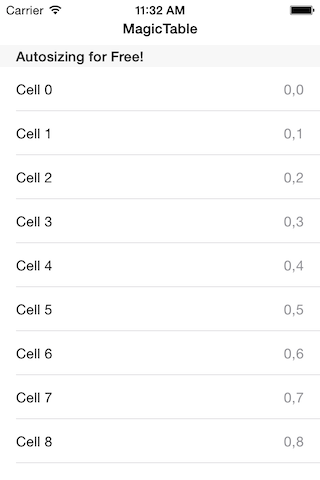
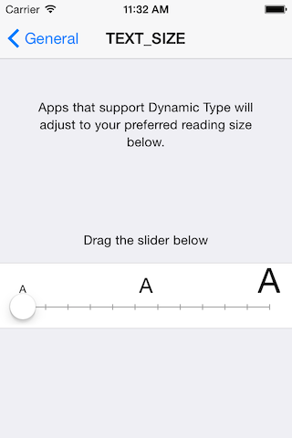
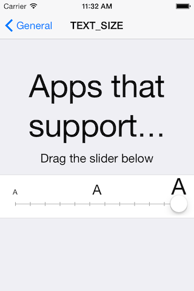
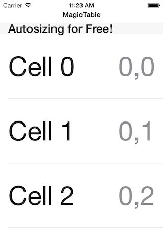

# iOS8 Day-by-Day :: Day 5 :: Auto-sizing table view cells

This post is part of a daily series of posts introducing the most exciting new
parts of iOS8 for developers - [#iOS8DayByDay](https://twitter.com/search?q=%23iOS8DayByDay).
To see the posts you've missed check out the [index page](http://shinobicontrols.com/iOS8DayByDay),
but have a read through the rest of this post first!

---

## Introduction

In iOS7 developers were introduced to the concept of dynamic type - which allows
the user to change the font size used within apps, via the settings panel. This
is really powerful, and can drastically improve the user experience for users
with varying qualities of eye-sight.

However, there was a huge problem associated with this - in the form of table
views. Although the type size can change, it was up to the developer to
define the height of cells in the table view. This would mean either
pre-calculating the values, or calculating them on the fly, neither of which was
easy. Surely there must be a better way?

Well, in iOS8 it is finally possible to have table view cells which can autosize
themselves. In this project we'll take a look at how easy it is to implement,
with a demo associated with dynamic type and with custom cells.

As with all articles in this series, the sample project is available on github at
[github.com/ShinobiControls/iOS8-day-by-day](https://github.com/ShinobiControls/iOS8-day-by-day).

## Using the 'stock' table view cells

When you first create a table view, chances are you've just used the stock
table view cells - of which there are 4 styles (basic, left detail, right detail,
and subtitle). In iOS8, the labels in the base `UITableViewCell` are pre-configured
for dynamic type. This means that they adapt to the text size specified in the
device settings panel.

Since these cells are also laid out using autolayout, they will autosize to fit
the differing sizes of text.

This actually means that you get auto-sizing table view cells __for free__ if you
just use the stock cells. To see this in action run up the accompanying
__MagicTable__ app:

If you then use the settings to change the text size (in the same way as iOS7):

And then return to the __MagicTable__ app then you'll be able to see the effect:

This is all well, and good, but more often than not you'll want to create your
own custom table cells. In order to do this, you need to understand a little bit
more about how the auto sizing actually works - let's take a look at that next.

## Creating custom table view cells

## Conclusion

Auto-sizing table view cells is something that developers have longed for, and
it's great news that iOS8 introduces this functionality. In many cases, since
you should already be using auto-layout, you'll just get this functionality for
free - just a matter of not specifying cell heights. It's definitely worth the
time to go and ensure that your existing tableviews support this behaviour.

As with all articles in this series, the sample project is available on github at
[github.com/ShinobiControls/iOS8-day-by-day](https://github.com/ShinobiControls/iOS8-day-by-day).
If you have any questions then feel free to comment below or hit me up on
twitter - I'm [@iwantmyrealname](https://twitter.com/iwantmyrealname).

sam
