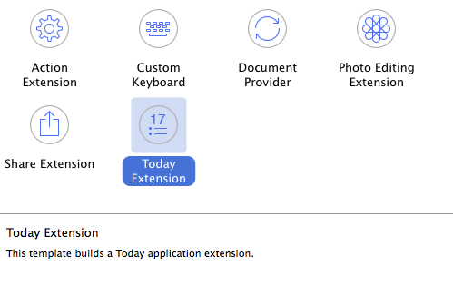

# iOS8 Day-by-Day :: Day 8 :: Today Extension

This post is part of a daily series of posts introducing the most exciting new
parts of iOS8 for developers - [#iOS8DayByDay](https://twitter.com/search?q=%23iOS8DayByDay).
To see the posts you've missed check out the
[introduction page](http://www.shinobicontrols.com/ios8daybyday),
but have a read through the rest of this post first!

---

## Introduction

Way back on day two of this blog series we took a look at the new sharing extension -
which is just one of six new extension points on iOS. Today, it's the chance of
the today extension, or widget.

Widgets allow you to add content to the today screen on a device. Until iOS8, this
area has been sacred - with only system apps being allowed to display anything
there. This new extension point will allow you to bring small amounts of relevant
info to your users, in an easily accessible fashion.

The project which accompanies this project is based around the Github user public
event feed. The app itself shows the most recent events, and the today widget
shows just the latest event. Throughout this post you'll learn how to create a
today extension, how to share code with the app, how to share cached data with
the app and how to communicate from the widget to the app.

The code for this project is available on Github at
[github.com/ShinobiControls/iO8-day-by-day](https://github.com/ShinobiControls/iOS80-day-by-day).

## Creating a widget

Like all other extensions, widgets have to be distributed as part of a host app
and therefore Xcode provides an extension to add a today extension target to
an existing project. This sets you up with a good foundation for a widget.

At its heart, a widget is just a view controller which gets displayed within the
context of the today overlay. The Xcode template includes a view controller, so
you can kick off by implementing the same things that you normally would within
that.

The Xcode template also includes a storyboard, already wired in, containing a
simple "Hello World" label. If your layout permits, using a storyboard will
allow you to create a layout which works well for a widget. It's certainly worth
using autolayout when designing your layout, as then it will cope well with
different devices.

Part of the difficulty using a storyboard for this design is that in order to
work well with the visual effects used on the today screen, your view should be
transparent. Therefore you can be building a view without really being able to
see it.

By default, a widget has a wide left margin - which will not be part of your
view controller's view. In order to alter this, a new protocol has been
introduced - `NCWidgetProviding`. This contains methods which allow you to
customise both the behaviour and the appearance of the widget. One of the
methods on this protocol is `widgetMarginInsetsForProposedMarginInsets()` which
passed you the default margin insets, and allows you to return your own version.
In the __GitHubToday__ sample project, the following override is used:

    func widgetMarginInsetsForProposedMarginInsets(defaultMarginInsets: UIEdgeInsets) -> UIEdgeInsets {
      let newInsets = UIEdgeInsets(top: defaultMarginInsets.top, left: defaultMarginInsets.left-30,
                                   bottom: defaultMarginInsets.bottom, right: defaultMarginInsets.right)
      return newInsets
    }

This extends the widget 30 points to the left. The design uses this space for
an icon which represents the type of event:

The other method on `NCWidgetProviding` is called by the system to ask whether
there are any updates available for the widget. This allows you to discover
whether there are any updates available, update the layout if necessary, and to
let the system know the result. The method is
`widgetPerformUpdateWithCompletionHandler(completionHandler:)` and you will see
a sample implementation of it from __GitHubToday__ later in the article.

First of all, you need to address a couple of issues, the first being how to
share code between the parent app and the widget.

## Sharing code with the parent app

## Sharing a cache with the parent app

## Navigating back to the parent app

## Conclusion
