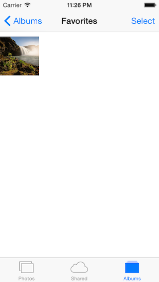

# iOS8 Day-by-Day :: Day 20 :: Photos Framework

This post is part of a daily series of posts introducing the most exciting new
parts of iOS8 for developers - [#iOS8DayByDay](https://twitter.com/search?q=%23iOS8DayByDay).
To see the posts you've missed check out the [index page](http://shinobicontrols.com/iOS8DayByDay),
but have a read through the rest of this post first!

---

## Introduction

Providing access to the images in the system photo gallery is a fairly standard
requirement for many apps - from social, through to photo editing. iOS has
provided this ability through many releases, but it has never been particularly
easy. In iOS8, a new __PhotoKit__ framework has been introduced, which provides
complete access to the user's photo gallery - from the models which make up the
library data structure, through to the automatic retrieval of images from within
iCloud.

This post is going to take a look at some of the basics of using the new
framework - from how the assets datastore is structured, accessed and updated
through to how you can create a caching image manager.

The accompanying app is called __StarGallery__ and is a simple implementation
of a gallery backed by the photo library. The app is able to update the
'favorite' status of the photos, and demonstrates how to use the in-built image
cache. As ever, the source code is available on the ShinobiControls github at
[github.com/ShinobiControls/iOS8-day-by-day](https://github.com/ShinobiControls/iOS8-day-by-day).

## Photo Library Outline

The library is comprised of model objects - the fundamental one being `PHAsset`,
which represents a single media asset. This could be a photo or a video, and has
properties including `pixelWidth`, `pixelHeight`, `creationDate`, 
`modificationDate` and `favorite`. All PhotoKit model objects are immutable,
so all of these properties are read-only.

These `PHAsset` objects are collected together into `PHAssetCollection` objects,
which are ordered collections of assets. These represent albums, smart albums
and moments and have properties such as `type`, `title`, `startDate` and
`endDate`.

Folders and years of moments are formed from `PHCollectionList`, which is again
and ordered collection.

The combination of these three classes allows the entire structure of the photo
library to be modeled. However, none of these give you access to anything other
than asset metadata. `PHImageManager` is used to request the image associated
with a given `PHAsset`. This handles any network requests, rescaling and can
even do caching. It can provide a placeholder image whilst the required quality
is requested from the network.

## Querying For Models

Each of the model classes has class methods associated with it to query the
photo library - for example `PHAsset` has `fetchAssetsWithMediaType()`. All the
model fetch methods are synchronous, and return an instance of `PHFetchResult`.
The following will create a fetch result containing all the images:

    let images = PHAsset.fetchAssetsWithMediaType(.Image, options: nil)

`PHFetchResult` has an API which looks very like `NSArray`, so you can iterate
through the results, access results by index, and count the total number of
items in the fetch result. Importantly, the items are lazy-loaded from the store
in batches - i.e. the results aren't all loaded in to memory at call-time, but
are instead loaded when required. This reduces the memory footprint on something
that could be a result set.

In the accompanying project, __StarGallery__, there is a collection view which
displays all the images in the photo library. The asset models are loaded using
the code snippet above in `viewDidLoad()`. As mentioned before, these objects
are just the models which represent the assets in the photo library - they don't
include the image itself. In the next section you'll learn how to request the
image.

## Requesting Assets

If you're going to use the photo library, then it's likely that you'll want to
get hold of the images themselves - not just the asset models. PhotoKit makes
this really easy, via the `PHImageManager` class. Once you've created an
instance, then you can request an image with the `requestImageForAsset()`
method, as follows:

    self.imageManager?.requestImageForAsset(imageAsset!,
                                  targetSize: CGSize(width: 320, height: 320), 
                                  contentMode: .AspectFill, options: nil) {
      image, info in
      self.photoImageView.image = image
    }

In addition to providing the `PFAsset` which represents the image, you also need
to provide a size and a content mode. This combination means that the image
manager will rescale the image appropriately and return it to you. This method
is asynchronous - with the image returned to the closure above. Since this is
usually going to be used to update the UI, the framework will invoke this
closure on the main queue. The closure might well be called more than once - if
the required image quality isn't immediately available then a placeholder may
well be provided until the request can be fulfilled (e.g. returned from the
network).

In addition the base `PHImageManager` class, PhotoKit also includes a 
`PHCachingImageManager`, which caches images, allowing preheating which results
in better scrolling performance. In order to use this you need to be able to
tell the image manager which assets it should start caching (i.e. load up) and
which ones it no longer needs to cache. Note that the cache works on specific
image sizes - so you can cache the same asset multiple times (at different sizes).

The following method is part of an `ImageCacheController` class in
__StarGallery__:

    func updateVisibleCells(visibleCells: [NSIndexPath]) {
      let updatedCache = NSMutableIndexSet()
      for path in visibleCells {
        updatedCache.addIndex(path.item)
      }
      let minCache = max(0, updatedCache.firstIndex - cachePreheatSize)
      let maxCache = min(images.count - 1, updatedCache.lastIndex + cachePreheatSize)
      updatedCache.addIndexesInRange(NSMakeRange(minCache, maxCache - minCache + 1))
      
      // Which indices can be chucked?
      self.cachedIndices.enumerateIndexesUsingBlock {
        index, _ in
        if !updatedCache.containsIndex(index) {
          let asset: AnyObject! = self.images[index]
          self.imageCache.stopCachingImagesForAssets([asset], targetSize: self.targetSize, contentMode: self.contentMode, options: nil)
          println("Stopping caching image \(index)")
        }
      }
      
      // And which are new?
      updatedCache.enumerateIndexesUsingBlock {
        index, _ in
        if !self.cachedIndices.containsIndex(index) {
          let asset: AnyObject! = self.images[index]
          self.imageCache.startCachingImagesForAssets([asset], targetSize: self.targetSize, contentMode: self.contentMode, options: nil)
          println("Starting caching image \(index)")
        }
      }
      cachedIndices = NSIndexSet(indexSet: updatedCache)
    }

As the user scrolls, this method is called with an array of `NSIndexPath`
objects for the visible cells. This method determines whether the cache needs
updating, based on the visible cells, and the `cachePreheatSize`. It then
updates the caching image manager with the `stopCachingImagesForAssets()` and 
`startCachingImagesForAssets()` methods.

Note that obtaining the image from a caching image manager is exactly the same
as the base `PHImageManager` - and it will obtain the image even if it doesn't
exist in the cache.

## Performing Model Updates

Having immutable model objects is great for thread-safety, but it does mean that
updating the photo library is made a little more complex. You can't just update
some settings on the model objects and then request the framework to persist
them. Instead, you must create a change request, and then get the library to
perform it.

`PHPhotoLibrary` has a `performChanges()` method, which takes a closure
containing the required change requests. Each of the model types has an
associated change request class - for example `PHAssetChangeRequest`, and they
are instantiated using a model object. Once you have the change request object,
you can mutate it to match the change you wish to perform. Since this is created
within the `performChanges()` closure, the framework will then perform this
change asynchronously.

In the accompanying app, there is a star button which, when pressed, will toggle
the 'favorite' status of an asset. The following is the method which gets called:

    @IBAction func handleStarButtonPressed(sender: AnyObject) {
      PHPhotoLibrary.sharedPhotoLibrary().performChanges({
        let changeRequest = PHAssetChangeRequest(forAsset: self.imageAsset)
        changeRequest.favorite = !self.imageAsset!.favorite
      }, completionHandler: nil)
    }

Here, the change request is created using `PHAssetChangeRequest(forAsset:)` with
the image asset associated with this cell, before toggling the value of the
`favorite` property.

In this instance the `completionHandler` closure is `nil`, but you can get a
callback with the status of the change request.

## Registering for Update Notifications

Now that you've managed to update the asset in the photo library, you might be
wondering about how to update your UI. You could use the completion block in the
`performChanges()` method, but there is a more generic approach.

You can subscribe to change notifications on a photo library, meaning that you
will be informed whenever it changes - irrespective of whether the change comes
from your app, or elsewhere (e.g. the Photos app).

Registering for updates is as simple as:

    PHPhotoLibrary.sharedPhotoLibrary().registerChangeObserver(self)

In order for this to work, your class must adopt the `PHPhotoLibraryChangeObserver`
protocol, which includes the `photoLibraryDidChange(changeInstance: PHChange!)`
method.

The `PHChange` class encapsulates the library update, and you can request either
to get the change details for a specific object, or a `PHFetchRequest`. In 
__StarGallery__, the `PHFetchResultChangeDetails` are requested for the fetch
request displayed in the collection view:

    func photoLibraryDidChange(changeInstance: PHChange!) {
      let changeDetails = changeInstance.changeDetailsForFetchResult(images)
      self.images = changeDetails.fetchResultAfterChanges
      dispatch_async(dispatch_get_main_queue()) {
        // Loop through the visible cell indices
        let indexPaths = self.collectionView?.indexPathsForVisibleItems()
        for indexPath in indexPaths as! [NSIndexPath]{
          if changeDetails.changedIndexes.containsIndex(indexPath.item) {
            let cell = self.collectionView?.cellForItemAtIndexPath(indexPath) as! PhotosCollectionViewCell
            cell.imageAsset = changeDetails.fetchResultAfterChanges[indexPath.item] as? PHAsset
          }
        }
      }
    }

This implementation then determines which of the visible cells are affected by
this change, and provides them with the updated model object, which will update
the appearance appropriately.

Note that in addition to the `fetchResultAfterChanges` and `changedIndexes`, the
`PHFetchResultChanges` class also includes details of inserted, deleted and
moved objects.

This now completes the 'favoriting' functionality of the __StarGallery__ app -
tapping the _star_ icon will toggle the favorite status:

You can check that the photo library underlying data store is being updated by
checking the favorites album in the Photos app:

## Conclusion

This new framework makes working with images on the device both much easier for
the developer and a more seamless experience for the user. In this article 
you've seen how to access the data models, the images and to perform simple
model updates. There is even more depth to the framework, which allows you to
create new assets, and to perform asset content edits as well. If you'd like to
read an article on some of the more advanced features then drop me a line.

As ever, the source code is available on the ShinobiControls github at
[github.com/ShinobiControls/iOS8-day-by-day](https://github.com/ShinobiControls/iOS8-day-by-day).

You should follow me on twitter - I'm [@iwantmyrealname](https://twitter.com/iwantmyrealname) -
and let me know if you'd like to read an article about advanced PhotoKit.

sam

