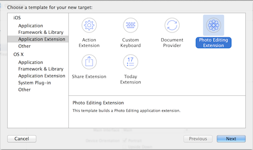

# iOS8 Day-by-Day :: Day 23 :: Photo Extension

This post is part of a daily series of posts introducing the most exciting new
parts of iOS8 for developers - [#iOS8DayByDay](https://twitter.com/search?q=%23iOS8DayByDay).
To see the posts you've missed check out the
[introduction page](http://www.shinobicontrols.com/ios8daybyday),
but have a read through the rest of this post first!

---

## Introduction

iOS8 Day-by-Day has looked at a couple of the new extensions in iO8 already -
the share extension and the today extension. In today's article you're going to
learn the basics behind the photo extension.

Extension points are ways that you can write your own code and functionality
which enhance the OS in more far-reaching ways than just your app. In the case
of photo extensions, you can create filters and more complex editing
functionality that will be available to the Photos app and any other apps which
request it.

The sample code which accompanies today's article builds a photo extension from
the chromakey core image filter that was used in day 19. You can get the source
code from the ShinobiControls github at
[github.com/ShinobiControls/iOS8-day-by-day](https://github.com/ShinobiControls/iOS8-day-by-day).

## Creating a Photo Extension

In the same way as for the other extension types, the easiest way to create a
photos extension is to use the template provided by Xcode 6:

This create a new target, and within it a subclass of `UIViewController`, which
adopts the `PHContentEditingController` protocol. This adds some lifecycle
methods which are are specific to photo extensions.

You can probably guess from the fact that this is a view controller, that a
photo extension has UI which is provided by you. In fact, the view controller is
presented with a navigation bar containing the name of the photo extension. The
rest is up to you. Since it's just a subclass of `UIViewController` you can use
all the usual techniques, including creating the design in a storyboard.

In the ChromaKey extension which accompanies this article, a simple design
including a slider is used to display the live result from the filter, and to
configure the threshold. This layout is created in the storyboard.

The project also contains the custom `CIFilter` class from day 19 - and the 
`PhotoEditingViewController` contains a reference to one:

    class PhotoEditingViewController: UIViewController, PHContentEditingController {
      
      let filter = ChromaKeyFilter()
      ...
    }

You'll use this filter both during the interactive editing phase, and also when
rendering the final image.

## Starting Interactive Editing

## Finalizing the Edit

## Resumable Editing

## Conclusion

Photo extensions are a quite specialized - unless your app is in the business of
providing custom image manipulation algorithms. That doesn't make them any less
cool - in fact the fact that Apple has opened up this kind of functionality is
really rather exciting for the platform.

In addition to all the easy-access retro-filters that we can all use to take
hipster photos of our food, I think it'll be really exciting to see what other
ideas people come up with. For example, you could use a photo extension to
implement a steganography algorithm right into a filter, and then use it from
the photos app. Pretty cool stuff.

The source code for today's algorithm is available, as ever, on the
ShinobiControls github at
[github.com/ShinobiControls/iOS8-day-by-day](https://github.com/ShinobiControls/iOS8-day-by-day).
Take a look at it and let me know if you disagree with it :) Or at least give me
a follow on twitter - I'm [@iwantmyrealname](https://twitter.com/iwantmyrealname).

sam

