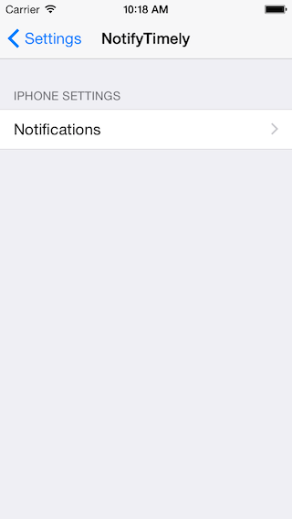

# iOS8 Day-by-Day :: Day 25 :: Notification Actions

This post is part of a daily series of posts introducing the most exciting new
parts of iOS8 for developers - [#iOS8DayByDay](https://twitter.com/search?q=%23iOS8DayByDay).
To see the posts you've missed check out the [index page](http://shinobicontrols.com/iOS8DayByDay),
but have a read through the rest of this post first!

---

## Introduction

Local and remote notifications have been an integral part of iOS for many years
now - allowing apps to respond to events even whilst they aren't running.
Notifications are either silent or visual, with visual notifications taking the
form of alerts or banners which the user can interact with. The interaction is
very limited though - either dismissing the notification or opening the app.

iOS8 introduces new notification actions - which allow you to hook into the
notification system and provide a set of customized actions that the user will
see and can execute alongside the notification.

Today's post digs into the new notification actions by creating a simple timer
app based on local notifications. Exactly the same principles apply for
providing custom actions for remote notifications too - just using push
notifications as a trigger. The sample application is called __NotifyTimely__
and the source code is available on github at
[github.com/ShinobiControls/iOS8-day-by-day](https://github.com/ShinobiControls/iOS8-day-by-day).

## Requesting Permission

Before getting started with the exciting new notification actions, it's worth
making note of some other changes to the UIKit notification system - in
particular the way you request permission from the user to present user
notifications.

In the past you had to request permission from the user for some aspects of
remote notifications, but not for local notifications. And the type of remote
notification (silent versus user) was mixed in with the request.

In iOS8 these two orthogonal concepts have been split out: an app has to
register both for its interest in receiving remote notifications, and also for
the specific types of user notifications it would like to utilize (for both
remote and local use).

### Remote Notifications

Registering for remote notifications is now super-simple - there is a method on
`UIApplication` which will perform the operation for you:

    UIApplication.sharedApplication().registerForRemoteNotifications()

The user won't actually be prompted at this point - new apps will be enabled by
default, however a user can disable remote notifications through the settings
app. You can check the status using the `isRegisteredForRemoteNotifications()`
method.

You need to do this to enable remote notifications of both the silent and user
variety, and if this is enabled then silent notifications will work as expected.
However, in order for user notifications to appear, then you need to register
these as well.

### User Notifications

User notifications are alerts, icon badges and sounds which are used to gain the
user's attention. The source for these can be either remote or local
notifications and, since they can be quite disruptive, require the user's
permission.

In iOS8, this is done using the `registerUserNotificationSettings()` method on 
`UIApplication`, providing a `UIUserNotificationSettings` object to specify what
permissions you require. In the simplest form you can use the following code to
register for sounds and alerts:

    let requestedTypes = UIUserNotificationType.Alert | .Sound
    let settingsRequest = UIUserNotificationSettings(forTypes: requestedTypes, categories: nil)
    UIApplication.sharedApplication().registerUserNotificationSettings(settingsRequest)

`UIUserNotificationType` can have values `.Badge`, `.Sound`, `.Alert` or `.None`,
and the `categories` parameter is related to custom actions - you'll learn about
it in the next section.

When the `registerUserNotificationSettings()` method is first run, the user will
see an alert which asks for permission to use notifications:

They won't see the alert again, but can update their choices in the app's page
in the settings app:

Once the user has responded to the user notification alert, UIKit will call the 
`application(_, didRegisterUserNotificationSettings:)` on the app delegate, with
the results of the request. Alternatively, the `currentUserNotificationSettings()`
method on `UIApplication` will provide you with the most up-to-date settings.
You can use this to alter your app's behavior appropriately - preventing the
creation of notifications which will never appear.

## Registering Actions

## Firing Actions

## Handling Actions

## Conclusion
