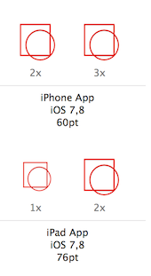

# iOS8 Day-by-Day :: Day 29 :: Safari Action Extension

This post is part of a daily series of posts introducing the most exciting new
parts of iOS8 for developers - [#iOS8DayByDay](https://twitter.com/search?q=%23iOS8DayByDay).
To see the posts you've missed check out the [index page](http://shinobicontrols.com/iOS8DayByDay),
but have a read through the rest of this post first!

---

## Introduction

This series has covered three of the new extension points so far (sharing,
today & photo) and today sees the turn of the action extension.

The action extension is quite similar to the sharing extension - in fact it
appears on the same 'share-sheet' popover UI. The difference is very much with
the intent: the sharing extension is used for exactly what its name suggests -
extracting content from an app for the purpose of sharing it, either directly or
via a social network.

In contrast, the action extension is intended to perform fairly light-weight
transformations of the content - either providing their own UI or returning
updated content to the requesting app.

Today's article will demonstrate how to create an action extension,
specifically for manipulating the content of web pages. The source code for the
app, __MarqueeMaker__ is available on github at
[github.com/ShinobiControls/iOS8-day-by-day](https://github.com/ShinobiControls/iOS8-day-by-day).

## Creating an Action Extension

Creating an action extension is best performed in the same way that you create
any of the extensions - via the templates in Xcode. Since all extensions
require that they are bundled with a host app, you need to create an app first,
and then add the extension to it:

Action extensions can either have UI or not. If your extension doesn't require
any input from the user in order to run, then you can choose not to have any UI.
The accompanying app does have some UI - allowing the user to specify which HTML
tags they'd like to manipulate:

Once you've done that then you'll be presented with a template that includes a
good starting point for building your extension. If you've selected to include a
user interface, then you'll be provided a view controller and storyboard in
which to build it. As ever, it's highly recommended to use adaptive layout to
create your interface.

You'll want to create an icon image to represent your app in the share sheet.
This icon is actually just the extension icon - which you can provide using an
asset catalog - ensuring that it is set correctly in the project settings:

Note that the action sheet uses template images - i.e. your icon image should be
composed of a single color and transparent. The non-transparent pixels will be
transformed to match the other icons in the sheet:

## Extracting Content from a Web Page

## Interacting with JavaScript

## Conclusion

