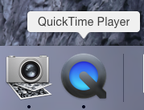
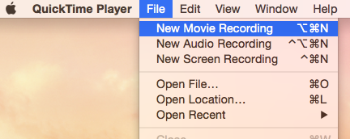
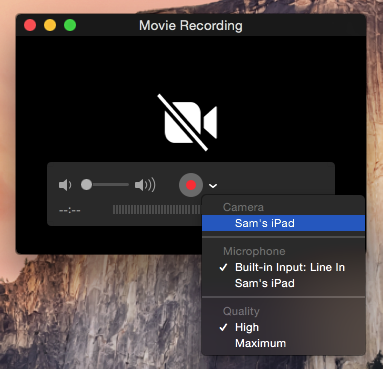
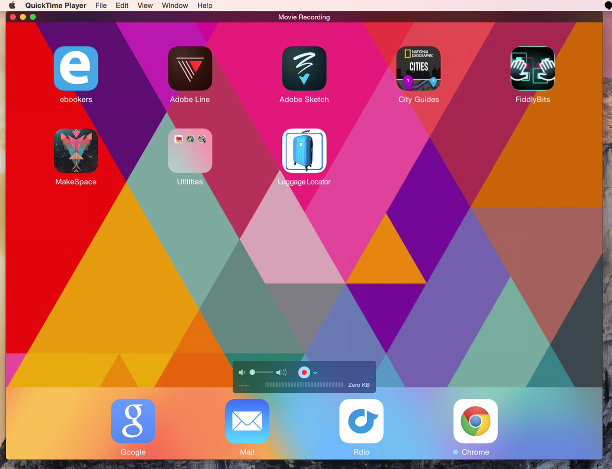

# iOS8 Day-by-Day :: Day 8 :: Today Extension

This post is part of a daily series of posts introducing the most exciting new
parts of iOS8 for developers - [#iOS8DayByDay](https://twitter.com/search?q=%23iOS8DayByDay).
To see the posts you've missed check out the
[introduction page](http://www.shinobicontrols.com/ios8daybyday),
but have a read through the rest of this post first!

---

## Introduction

The screenshots that adorn your app's page in the App Store have always been
incredibly important in advertising your app - giving a flavor of what a user
can expect and attempting to get them to push the all-important __Buy__ button.
Back when iOS7 was first announced I wrote a blog post about how given the new,
flatter UI design, screenshots just weren't going to cut it any more 
([iOS7: What does it mean for developers?](http://www.shinobicontrols.com/blog/posts/2013/07/01/ios7-what-does-it-mean-for-developers)),
and it seems that Apple agree. Starting with iOS8, you can now upload a short
video to demo your app, to be displayed alongside the screenshots in the App
Store.

In today's article you'll learn how to create these videos, and take a look at
some of the recommendations from Apple regarding their content. Since it's still
early days in the video approval process, there is little empirical evidence
as to how strictly the rules are applied - with time the community will learn
both what what works, and what Apple is happy to approve.

In a change to the standard format, today's post doesn't have a sample project.
It does describe how to get started with recording video from your device - with
a sample demoing the __MarqueeMaker__ action extension from day 29.

## Recording a Video

In the past, when wanting to record video from a device you'd have to resort to
using AirPlay and a 3rd-party app on OSX. AirPlay has low resolution, and a high
compression ratio - allowing it to work over wireless networks. This means that
a recording from a device looks shabby at best.

New to iOS8 and OSX Yosemite, it's now possible to record directly from the
device onto your computer. In fact, when you plug in an iOS8 device (via a
lightning cable) it appears as a new camera.

To record a video, you need to start out by opening QuickTime. Note, that by
default, QuickTime doesn't open a window when you start it - but you can see
that it has started in the dock:

You start a new recording via the __File__ menu:

This will open a new window and tell you that you need to select a camera:

If your iOS8 device is connected via a lightning cable then you'll be able to
select it as a camera from the source menu:

QuickTime will then resize to mirror your device's current screen, at which
point you can start recording. Notice also that the status bar has changed from
the regular one to the standard one - displaying the "Apple Time" of 09:41,
removing your service provider and filling your battery:

This will allow you to create a simple video, that at the very least will allow
you to record the source material to cut together to build your complete demo
video.

<video src="assets/sampleVideo.mov"
             controls
             height=480 width=268>
</video>

## Video Considerations

## Conclusion
