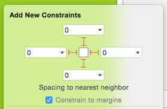
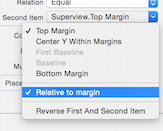
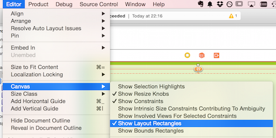
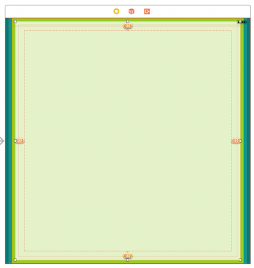
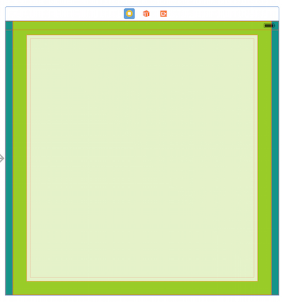

# iOS8 Day-by-Day :: Day 32 :: Layout Margins

This post is part of a daily series of posts introducing the most exciting new
parts of iOS8 for developers - [#iOS8DayByDay](https://twitter.com/search?q=%23iOS8DayByDay).
To see the posts you've missed check out the [index page](http://shinobicontrols.com/iOS8DayByDay),
but have a read through the rest of this post first!

---

## Introduction

If you've been using the Pin menu in Xcode 6 then you might have noticed the addition of a slightly mystical option - __Constrain to margins__:

If you've left this option ticked then you'll have an idea what it does,
although at first the behavior can seem a little confusing.

Today's post digs down into what layout margins are, what the represent to the
Auto Layout system, how to use them in IB and how to use them in code. There is
an accompanying project which demos these concepts - but be warned - the
majority of it uses the storyboard. You can grab it on the ShinobiControls
github at
[github.com/ShinobiControls/iOS8-day-by-day](https://github.com/ShinobiControls/iOS8-day-by-day).

## Layout Margins in Interface Builder

Layout margins represent padding around the interior of a `UIView` that the
layout system can use when laying out subviews - to ensure that a gap is left
between the edge of a view and a subview. In this respect it is very much like
the padding property associated with blocks in CSS.

You've already seen one of the places that margins appear in interface builder -
in the pin menu. When creating new auto layout constraints, you can choose them
to be relative to the margins of a view instead of the bounds:

By default, a `UIView` has layout margins of 8 points on each side - but you can
change this using the `layoutMargins` property. This takes a `UIEdgeInsets`
object - which just comprises 4 `CGFloat` values - one for each of top, bottom,
left and right.

These margins are only used if you're using Auto Layout - and represent an
additional attribute you can specify when creating an `NSLayoutConstraint`. In
IB, when you look at the size inspector for a constraint then you can see that
it's possible to choose whether a constraint should be margin relative or not:

Changing this is likely to update the appearance of a layout in IB - but it is
really helpful to be able to see the layout margins whilst building your layout.
You can get IB to display the margins with __Editor > Canvas > Show Layout
Rectangles__:

## Layout Margins in Code

When you select that an auto layout constraint should be margin relative in IB,
then you are actually updating the layout attributes associated with that
constraint. An auto layout constraint describes a relationship between two view
objects, and each of these has an associated attribute that specifies what
aspect of the view the layout engine should be using during the layout process.
For example, there are attributes for left edge, right edge etc. In order to
support layout margins, the `NSLayoutAttribute` enum has been updated in iOS8 to
include the following margin-related cases:

    enum NSLayoutAttribute : Int {
        ...
        case LeftMargin
        case RightMargin
        case TopMargin
        case BottomMargin
        case LeadingMargin
        case TrailingMargin
        case CenterXWithinMargins
        case CenterYWithinMargins
        ...
    }

You can alter the layout margins themselves using the `layoutMargins` property -
which just takes a `UIEdgeInsets` object.

Since IB doesn't currently have the UI to alter the layout margins, you could
build your own `UIView` subclass which allows the user to alter them in IB:

    @IBDesignable
    class MarginConfigView: UIView {
      @IBInspectable
      var margin: CGFloat = 16 {
        didSet {
          self.layoutMargins = UIEdgeInsets(top: margin, left: margin,
                                            bottom: margin, right: margin)
        }
      }
    }

The above class has a common margin size for all four sides, and allows you to
alter it in IB:

Setting this value will update the canvas to demonstrate that there are now
unsatisfied constraints:

Note that you can see the updated margin positions. You can of course get IB to
update its layout to satisfy the constraints:

If you are performing manual layout, then you might also wish to override 
`layoutMarginsDidChange()`, which will be called whenever the margins are
changed - allowing you to update your layout appropriately.

## Preserving Superview Layout Margins

## Conclusion

