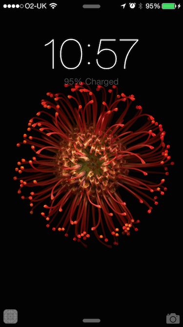
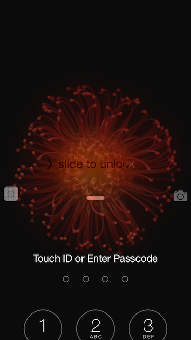

# iOS8 Day-by-Day :: Day 38 :: Handoff

This post is part of a daily series of posts introducing the most exciting new
parts of iOS8 for developers - [#iOS8DayByDay](https://twitter.com/search?q=%23iOS8DayByDay).
To see the posts you've missed check out the [index page](http://shinobicontrols.com/iOS8DayByDay),
but have a read through the rest of this post first!

---

## Introduction

One of the key new concepts introduced at WWDC in 2014 was that of Continuity,
describing the ability to seemlessly switch between devices, and continue your
task. The underlying technology behind Continuity is called Handoff, and it
works across both iOS and Yosemite.

Today's article introduces the just one of the vectors through which Handoff can
work - native iOS app to native iOS app. The app which accompanies the post is
called __MapOff__ and is a simple map view. When you open the app via Handoff on
a different device, then the currently visible region on the first map will be
transferred to the receiving device.

As ever, the code for today's app is available on the ShinobiControls github at
[github.com/ShinobiControls/iOS8-day-by-day](https://github.com/ShinobiControls/iOS8-day-by-day).

## Handoff Logistics

Handoff is based around user activities. These are objects which encapsulate the
current state of what the user is doing, or at least enough to recreate the 
'session' elsewhere. An activity has a type associated with it, which allows the
operating system to determine whether it has an app which can resume a given
activity.

Handoff works by first using bluetooth LE to discover devices in the locality
that are signed in to the same iCloud account. If the current app is handoff
enabled, and it can find a device that is able to resume the current activity,
then the inactive device will show an icon notifying the user that they can
Handoff from one device to the other.

When the user chooses to continue this activity, the sending device will
transfer the activity object to the continuing device, allowing it to continue
the same activity.

As a developer, you can either integrate with Handoff manually, or, if you have
a document-based app, you can rely on the deep integration with `UIDocument`.
This article will take a look at the manual approach - for further details on
integration with `UIDocument`, take a look at the 
[Handoff programming guide](https://developer.apple.com/library/ios/documentation/UserExperience/Conceptual/Handoff/HandoffFundamentals/HandoffFundamentals.html#//apple_ref/doc/uid/TP40014338-CH3-SW1).

## Preparing an App for Handoff

In order to Handoff from an app, it needs to prepare an maintain one or more
`NSUserActivity` objects. These encapsulate what the user is currently doing,
allowing it to be resumed on another device. iOS8 introduces some new features
on `UIResponder` for handling user activities - one of which is a `userActivity`
property. Since `UIViewController` is a subclass of `UIResponder`, you can use
the new features to ease the Handoff workflow.

In __MapOff__, the user activity is created and configured in `viewDidLoad()`:

    let activityType = "com.shinobicontrols.MapOff.viewport"
    
    override func viewDidLoad() {
      super.viewDidLoad()
      if userActivity?.activityType != activityType {
        userActivity?.invalidate()
        userActivity = NSUserActivity(activityType: activityType)
      }
      userActivity?.needsSave = true
      ...
    }

A user activity object has an `activityType` property, which allows the system
to determine whether there is an app that can continue the activity. This is a
string, and should be in reverse-DNS form - as shown above.

You'll also notice that you set the `needsSave` property to `true`. Every time
the user interacts with your app, and you need to update the 'resume
instructions', you need to repeat this. This property allows the system to
lazy batch updates rather than with every user interaction. When this property
is set to `true`, the system will periodically call `updateUserActivityState()`
on your `UIViewController` subclass. This gives you an opportunity to save the
state.

In __MapOff__, this method is used to get the currently visible range from the
map, and save it into the `userInfo` dictionary:

    override func updateUserActivityState(activity: NSUserActivity) {
      let regionData = withUnsafePointer(&mapView.region) {
        NSData(bytes: $0, length: sizeof(MKCoordinateRegion))
      }
      activity.userInfo = ["region" : regionData]
    }

The `userInfo` dictionary can use simple types such as `NSString`, `NSNumber`,
`NSData`, `NSURL` etc. Since these types don't include the `MKCoordinateRegion`
struct, it's necessary to pack it into an `NSData` object. Note that you might
expect to use some kind of archiver, but `MKCoordinateRegion` is a pure Swift
struct, so doesn't implement the `NSCoding` protocol. Since it is a struct
value-type (i.e. doesn't contain references to non-value objects) it's possible
to use `NSData` to copy the bytes. __This won't always be the case__, so be
careful.

If you've got lots of data to transfer then the `userInfo` dictionary isn't the
place to do it - in fact Apple recommends that the the user activity object
should be kept below 3kb. However, user activities provide functionality for
setting up and consuming streams between the devices - at which point you can
send whatever you wish.

As mentioned before, the `needsSave` property should be set to `true` every time
the state of the UI updates. In __MapOff__ this occurs every time the user pans
or zooms the map - i.e. the region changes. Implementing the following delegate
method has the desired effect:

    // MARK:- MKMapViewDelegate
    func mapView(mapView: MKMapView!, regionDidChangeAnimated animated: Bool) {
      userActivity?.needsSave = true
    }

At this point, you've implemented everything you need to for an app to advertise
that it supports Handoff, but you also need an app that the user can resume
their activity on.

## Resuming an Activity

When the system can see that a a device is advertising the availability of
Handoff in the local area, it has to decide whether or not it has an app that
can handle it. Apps can use the `NSUserActivityTypes` key in __Info.plist__ to
specify which activities it is capable of Handing off. This is an array of
strings, and should include all the reverse-DNS activity types that you require:

Note that you can only Handoff between apps which are signed by the same
developer.

Once you've done this, then when a user chooses to continue an activity, your
app will be started, and two new methods on your application delegate will be
called:

    func application(application: UIApplication, willContinueUserActivityWithType userActivityType: String) -> Bool {
      println("Will continue \(userActivityType)")
      return true
    }
    
    func application(application: UIApplication, continueUserActivity userActivity: NSUserActivity, restorationHandler: ([AnyObject]!) -> Void) -> Bool {
      if let rootVC = window?.rootViewController {
        restorationHandler([rootVC])
      }
      return true
    }

The first of these, `application(_:, willContinueUserActivityWithType:)`
notifies you that the activity is going to continue. At this stage, only the
type of activity is available to you, not the activity itself. This is because
it might take some time for the activity to be transferred between the two
devices. At this stage you can prepare your app to continue the specified
activity - which is especially useful if your app can continue a variety of
different activities. This could involve loading a specific view controller, or
navigating to a particular area of your app.

Once the `NSUserActivity` has arrived on the receiving device, the second
delegate method will be called:
`application(_:, continueUserActivity:, restorationHandler:)`. At this point you
can extract the `userInfo` dictionary from the `userActivity` and use the
supplied information to update the UI appropriately.

The method also supplies a `restorationHandler` closure. This takes an array of 
`UIResponder` objects, and calls the `restoreActivityState(_)` method on each of
them. Since __MapOff__ is centered around a single view controller, this is what
is used there.

Dropping back to the view controller, the implementation of this method is as
follows:

    override func restoreUserActivityState(activity: NSUserActivity) {
      if activity.activityType == "com.shinobicontrols.MapOff.viewport" {
        // Extract the data
        let regionData = activity.userInfo!["region"] as! NSData
        // Need an empty coordinate region to populate
        var region = MKCoordinateRegion(center: CLLocationCoordinate2D(latitude: 0.0, longitude: 0.0),
                                          span: MKCoordinateSpan(latitudeDelta: 0.0, longitudeDelta: 0.0))
        regionData.getBytes(&region, length: sizeof(MKCoordinateRegion))
        mapView.setRegion(region, animated: true)
      }
    }

This implementation checks that it is responding to the correct activity type,
before extracting the data from the `userInfo` dictionary. Note once again that
this process is a little more complex than you might be expecting, since
`MKCoordinateRegion` doesn't implement `NSCoder`. Once the region has been
extracted, the map view is updated to show the same region.

Starting with the following view on an iPad:

Since __MapOff__ doesn't have a nice icon, the generic icon appears on the lock
screen to signify that Handoff is available. Dragging this up will invoke the
Handoff:

This starts __MapOff__ on the iPhone, and passes it the user activity. This
causes the map to display the same range:

## Conclusion

Handoff is extremely powerful, and this article only just scratches the surface.
In addition to being able to Handoff between different the same app on different
iOS devices, you can also Handoff between OSX apps and iOS apps. You can even
Handoff between native apps and webpages - in both directions! This means that
you could visit a website on your Mac, and then Handoff to an iOS app on your
iPhone - I really can't wait for more websites to start implementing this kind
of functionality.

Handoff is one of the coolest things to be introduced in iOS8. It feels to me
like a window into the future of personal computing, and goes some way to
solving a common problem. It's a very "Apple" problem and solution: "Why should
it matter which of my devices I'm using?". That's a technology problem, and this
is a good step towards a solution. I'll be really interested to see how
different apps use this, and whether the integration within the OS is good
enough to drive significant adoption and changes in my behavior.

The code for today's sample project, __MapOff__ is available in the iOS8
Day-by-Day repo on github at
[github.com/ShinobiControls/iOS8-day-by-day](https://github.com/ShinobiControls/iOS8-day-by-day).

Take a look and then come up with some really cool ideas for me to use :)

sam

